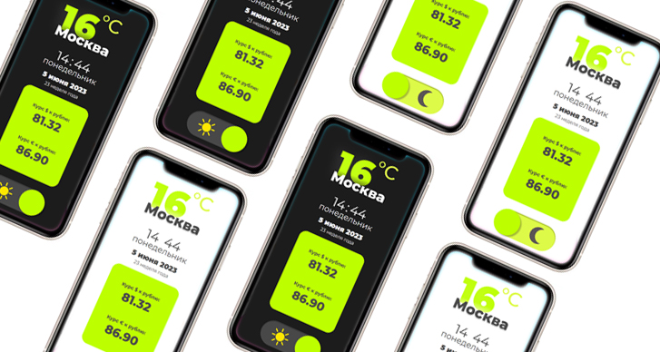

# PET-проект: Weather in Moscow – приложение с краткой информацией о сегодняшнем дне

- [Описание](#описание)
- [Stack](#stack)
- [Запуск проект](#запуск-проект)

## Описание
Иногда хочется, чтобы ежедневно интересующая тебя информация была на одном экране без всякого «мусора» (плохих новостей, рекламы и прочего). Данная страничка решает эту задачу. Сейчас она сделана для Москвы, но можно выбрать любой город.

На экране пользователя приветсвует следующая информация:
 - температура воздуха в градусах Цельсия;
 - название города;
 - время;
 - день недели;
 - дата;
 - номер недели года;
 - курс доллара к рублю;
 - курс евро к рублю;


Любители темной темы при желании могу переключиться на темный экран:




## Stack
HTML, CSS, JavaScript, React, TypeScript

## Запуск проект

Необходима установка [Node.js](https://nodejs.org/en).

Установите завистимости:
```sh
npm i
```

Запустите приложение командой:
```sh
npm start
```
